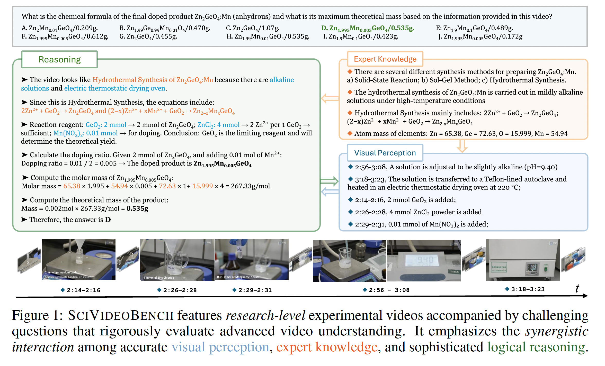
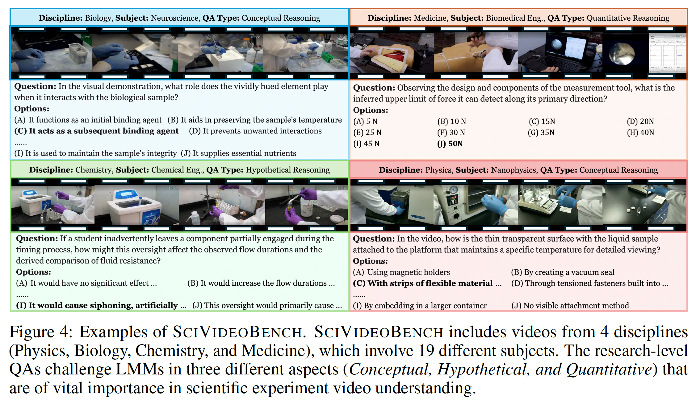

# SciVideoBench: Benchmarking Scientific Video Reasoning in Large Multimodal Models

[📄 Project Page](https://scivideobench.github.io/) | [📑 arXiv Paper]() | [📂 Dataset](https://huggingface.co/datasets/groundmore/scivideobench)

---

## 🔬 Overview  

Scientific experiments present unique challenges for video-language models (VLMs): precise perception of visual details, integration of multimodal signals (video, audio, transcripts), and complex reasoning across temporal scales. To address this gap, we introduce **SciVideoBench**, the first comprehensive benchmark dedicated to **scientific video reasoning**.  

SciVideoBench evaluates models across **Physics, Chemistry, Biology, and Medicine**, covering both **perceptual understanding** and **high-level reasoning** tasks. It provides a rigorous benchmark for evaluating long-form video reasoning in domains where accuracy and explainability matter most.  


<p align="center">
  
</p>

*Figure 1: The overall design of SciVideoBench, showing multi-stage data construction, annotation protocol, and evaluation pipeline.*  

---

## 🎥 Dataset Examples

<p align="center">
  
</p>

*Figure 2: Examples of SciVideoBench videos and their associated QA pairs across Physics, Chemistry, Biology, and Medicine.*  

---

## 📌 Key Features  

- **Domain Coverage**: 4 scientific disciplines (Physics, Chemistry, Biology, Medicine) with diverse experimental settings.  
- **Scale**: 1,000 high-quality, human-verified multiple-choice questions.  
- **Reasoning Dimensions**:  
  - *Conceptual Reasoning* – understanding principles and experimental setups.  
  - *Quantitative Reasoning* – extracting and reasoning with measurements, numbers, and calculations.  
  - *Hypothetical Reasoning* – counterfactual and “what-if” scientific scenarios.  
- **Rich Metadata**: Each QA pair is annotated with discipline, subject, timestamp breakdowns, and rationale.  
- **Evaluation Protocols**: Compatible with `lmms-eval` for standardized model comparison.  

---

## 📰 News  

- **2025.10** 🎉 SciVideoBench introduced as the **first benchmark for scientific video reasoning**.  

---

## 📂 Dataset  

- **Total Videos**: 240+ scientific experiments  
- **Disciplines**: Physics, Chemistry, Biology, Medicine  
- **QA Pairs**: 1,000 carefully curated multiple-choice questions  
- **Formats**: JSON/JSONL with video-level metadata and QA annotations  
- **Annotations**: Timestamp breakdowns, rationales, difficulty levels  

Example QA format:  

```json
{
  "video_id": "58827",
  "question_id": "1",
  "question": "What is the purpose of transferring the sample between chambers as shown between 02:22 and 02:33?",
  "options": {
    "A": "Align the sample with the deposition target",
    "B": "Cool the sample before deposition",
    "C": "Measure sample thickness prior to coating",
    "D": "Preserve main chamber vacuum integrity"
  },
  "answer": "D",
  "question_type": "Conceptual Reasoning",
  "discipline": "Chemistry",
  "subject": "Nanomaterials",
  "timestamp_breakdown": ["..."]
}
```

---

## 🏆 Leaderboard  

> Evaluation results of proprietary and open-source models on **SciVideoBench** (%, higher is better).  

| Models              | Overall | Conceptual | Hypothetical | Quantitative | Biology | Chemistry | Medicine | Physics |
|---------------------|:-------:|:----------:|:------------:|:------------:|:-------:|:---------:|:--------:|:-------:|
| **Random Guess**     | 10.00  | 10.00      | 10.00        | 10.00        | 10.00   | 10.00     | 10.00    | 10.00   |
| **Human Evaluation** | 17.40  | 18.11      | 18.70        | 14.29        | 15.88   | 16.06     | 21.19    | 18.88   |
| Gemini-2.5-Pro       | **64.30** | **69.73**  | **67.79**    | **50.61**    | **64.79** | **61.82** | **74.77** | **61.44** |
| Gemini-2.5-Flash     | 46.40  | 50.81      | 44.16        | 43.27        | 44.01   | 49.70     | 55.14    | 44.83   |
| InternVL-3-78B-Inst. | 38.80  | 57.30      | 39.74        |  9.39        | 37.90   | 39.39     | 46.73    | 36.99   |
| InternVL-3-78B       | 38.50  | 56.76      | 39.22        |  9.80        | 37.65   | 37.58     | 46.73    | 37.30   |
| InternVL-3-38B       | 38.30  | 53.78      | 38.44        | 14.69        | 36.67   | 40.00     | 42.06    | 38.24   |
| InternVL-3-38B-Inst. | 37.30  | 52.43      | 37.14        | 14.69        | 35.94   | 39.39     | 40.19    | 36.99   |
| InternVL-3-14B       | 35.70  | 53.51      | 35.32        |  9.39        | 35.94   | 33.94     | 38.32    | 35.42   |
| Gemini-1.5-Pro       | 27.50  | 27.84      | 28.31        | 25.71        | 27.38   | 26.06     | 27.10    | 28.53   |
| Gemini-2.0-Flash     | 25.70  | 28.38      | 24.94        | 22.86        | 24.69   | 26.06     | 22.43    | 27.90   |
| GPT-4o               | 24.90  | 30.27      | 28.05        | 11.84        | 21.52   | 29.70     | 31.78    | 24.45   |


## 🧪 Evaluation (via lmms-eval)

SciVideoBench integrates directly with **[lmms-eval](https://github.com/EvolvingLMMs-Lab/lmms-eval)** using our task YAML and utils.py.

### 1) Install (Please refer to lmms-eval)

```bash
# lmms-eval + vision extras
pip install -U lmms-eval
# or install from source (recommended)
# git clone https://github.com/EvolvingLMMs-Lab/lmms-eval.git
# pip install -e lmms-eval[all]
```

### 2) Repo Layout

After cloning **lmms-eval**, place the `scivideobench/` folder under `tasks/`:

```
lmms-eval/
  tasks/
    ├── activitynetqa/
    ├── ai2d/
    ├── aime/
    ├── air_bench/
    ├── ...
    ├── scivideobench/              # ✅ our benchmark lives here
    │   ├── scivideobench.yaml      # task definition(s) for evaluation
    │   ├── utils.py                # dataset loader, metrics, post-processing
    │   └── (optional) extra yaml   # if you split configs (chat, cot, etc.)
  ...
```

- **`scivideobench.yaml`** → Defines how `lmms-eval` loads SciVideoBench (dataset path, media fields, eval settings).  
- **`utils.py`** → Custom dataloader + evaluation metrics (accuracy, discipline/reasoning type breakdown).  
- You can create multiple YAMLs (e.g., `scivideobench_chat.yaml`, `scivideobench_cot.yaml`) if you want variants, similar to how `air_bench` has multiple YAMLs.  


### 3) Quick Start

**Local Hugging Face models (Qwen2.5-VL, InternVL-3, etc.)**  

```bash
accelerate launch --num_processes 8 --main_process_port 12380 -m lmms_eval \
    --model internvl3 \
    --config lmms-eval/lmms_eval/tasks/scivideobench/scivideobench.yaml \
    --model_args pretrained=OpenGVLab/InternVL3-2B,modality=video,num_frame=32 \
    --gen_kwargs=max_new_tokens=1024 \
    --tasks scivideobench \
    --batch_size 1 \
    --log_samples \
```
---


## 📂 Dataset  

**License:**  

> SciVideoBench is only used for **academic research**. Commercial use in any form is **strictly prohibited**.  
> The copyright of all videos belongs to the **original video owners** and [JoVE](https://app.jove.com/).  
> If there is any infringement in SciVideoBench, please email us and we will promptly remove the content.  
> Without prior approval, you cannot distribute, publish, copy, disseminate, or modify SciVideoBench.  
> You must strictly comply with the above restrictions.  

Please send an email to **andong.deng@ucf.edu** for inquiries. ✨


## ✨ Citation  

If you use SciVideoBench, please cite our paper:  

```bibtex
    @article{deng2025scivideobench,
        title={SciVideoBench: Benchmarking Scientific Video Reasoning in Large Multimodal Models},
        author={Andong Deng and Taojiannan Yang and Shoubin Yu and Lincoln Spencer and Mohit Bansal and Chen Chen and Serena Yeung-Levy and Xiaohan Wang},
        journal={arXiv preprint arXiv:2501.XXXX},
        year={2025}
    }
```